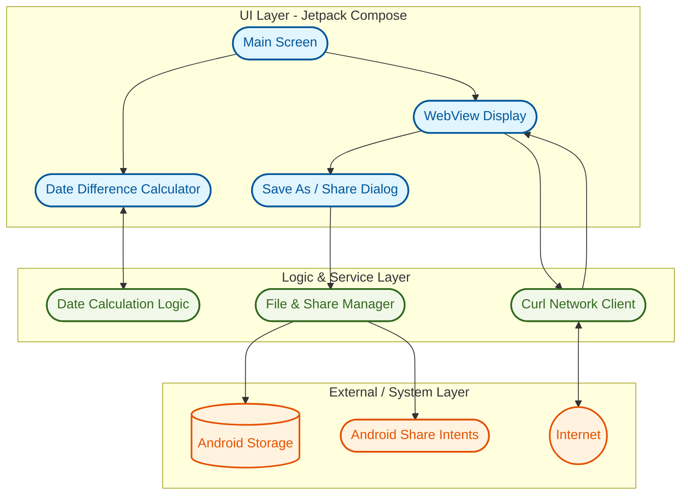

<h1 align="center">AndroidToolbox</h1>

Providing functionality missing in the [more secure](https://grapheneos.org/features) AOSP-bases distributions (Android™, GrapheneOS) such as curl compared to less secure "desktop" operating systems. 

## Features

- [x] Basic Curl implementation for fetching HTML, JavaScript, CSS, Markdown and Other (treated as txt) from a URL and displaying it using the system WebView.)
 - [x] "Save as" FAB dialog allowing to:
  - save as Plaintext txt
  - save as source
  - share
- [X] Date difference Calculator
- [x] MDY UI, both in native Compose and WebView parts of the app with large screen support.
- [x] Disabled insecure JIT compilation
- [x] opt into highest security available MTE modes

## Screenshots

 

## Backlog
- [ ] publish app on [Accrescent](https://accrescent.app) once [submissions are public](https://infosec.exchange/@accrescent/117152213429980044)

## Permissions
- `android.permission.INTERNET` (required for curl functionality)
- [sensors permission](https://grapheneos.org/features#sensors-permission-toggle) (only on [GrapheneOS](https://grapheneos.org), can't be removed as a developer) 

## Architecture

## Paper
(will be added once finished with personally identifying information redacted)
